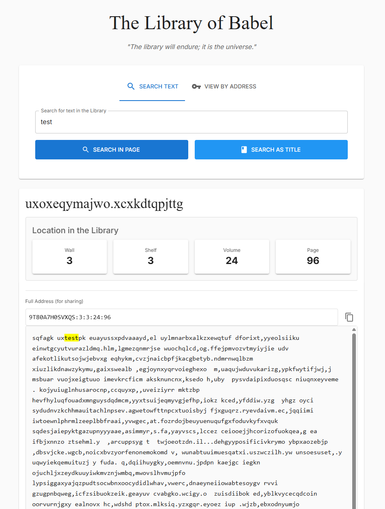

# My Library of Babel: A Personal Exploration

I built this to explore ideas from Jorge Luis Borges' "The Library of Babel," a short story about an infinite library containing every possible book. This is a small digital version of that concept, where I'm playing with how programming structure can express philosophical ideas.  I originally got this idea from the [Libary of Babel Website](https://libraryofbabel.info/).



This is a fun, personal project, not a production-ready application.

## Getting Started

If you want to run this project locally, here are the steps.

### Prerequisites

This project requires Node.js 24 (which includes npm). You can download it from the [Node.js website](https://nodejs.org/).

### Installation

1. **Clone the repository:**

    ```bash
    git clone https://github.com/LoganCorey/tower-of-babel.git
    cd tower-of-babel
    ```

2. **Install dependencies:**

    ```bash
    npm install
    ```

### Available Scripts

You can run:

* **`npm run dev`**
    Starts the development server. Open [http://localhost:5173](http://localhost:5173) to view it in your browser. The page will reload when you make changes.

* **`npm run build`**
    Builds the app for production to the `dist` folder.

* **`npm run lint`**
    Runs ESLint to check for code quality and style issues.

* **`npm run preview`**
    Serves the production build locally so you can check it before deploying.

* **`npm run test`**
    Runs tests in interactive watch mode.

## Running with Docker

If you prefer to run the app in a container instead of installing Node.js locally:

1. **Build the image:**

    ```bash
    docker build -t tower-of-babel .
    ```

2. **Run the container:**

    ```bash
    docker run -p 8080:80 tower-of-babel
    ```

3. Open [http://localhost:8080](http://localhost:8080) in your browser.

To stop the container, press `Ctrl+C` or run `docker stop <container-id>`.

## Technologies I Used

I built this with:

* **React:** For building the user interface.
* **TypeScript:** To help keep the code clean and maintainable.
* **Vite:** For a fast development server with quick rebuilds.

## How It Works

### Searching for text

When you search for a phrase, the app doesn't scan through any stored books. It calculates a fixed, deterministic location for that exact string.

1. The search string is hashed using a djb2-style hash, which seeds a linear congruential generator (LCG).
2. The LCG produces four numbers mapping to a location: wall, shelf, volume, and page.
3. The location string is hashed again to produce a second seed.
4. The search string is padded at the beginning with random filler characters, placing it at a random depth on the page.
5. Each character is shifted forward by a pseudo-random offset within the output character set, encoding the text into the hex part of the address.

The result is an address in the format `hex:wall:shelf:volume:page` that always maps back to your original text.

### Building a page

When you visit an address, the process runs in reverse. The location hash is reconstructed, fed back into the LCG, and each character in the hex string is shifted back to recover the original padded text. The remaining characters up to 3200 are filled with pseudo-random output from the LCG.

Titles follow the same process but use a separate hashing convention and cap at 25 characters.

### Limitations

* **Input characters:** Only lowercase letters (a to z), comma, period, and space are supported. Uppercase, numbers, and most punctuation are not part of the character set.
* **Not a real search:** The library has no stored content and on the fly a  location is calculated for it. Every possible string already has a fixed address, and the same input always returns the same one.
* **Page length:** Searched text cannot exceed 3200 characters, the length of one page.
* **LCG quality:** The random number generator is a simple LCG with fixed parameters. It's deterministic and repeatable, not cryptographically strong. Long enough sequences will cycle.
* **Hash collisions:** Two different input strings can produce the same hash, landing at the same location. This is unlikely for short inputs but is possible.
* **Title truncation:** Titles longer than 25 characters are cut off.
